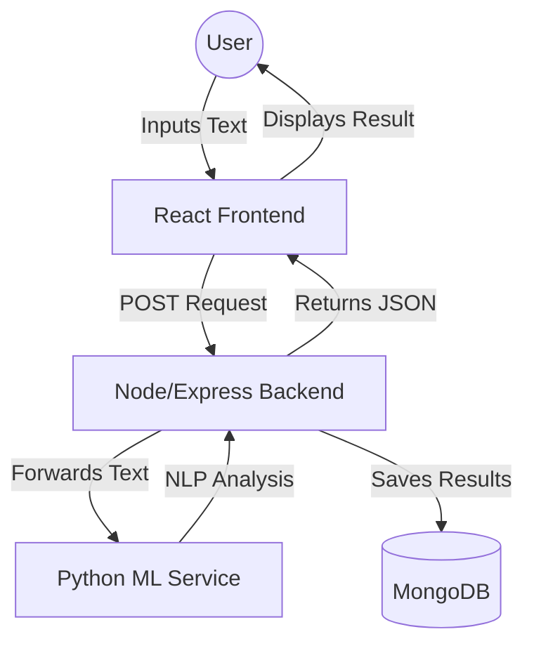

# Project Explanation: Fake Job & Scam Detection System

## 1. Project Overview
The **Fake Job Detection System** is a full-stack web application designed to identify fraudulent job listings, phishing emails, and scam messages. It leverages a **Microservices Architecture** combining the **MERN Stack** (MongoDB, Express, React, Node) with a dedicated **Python ML Service** for Natural Language Processing (NLP).

## 2. Architecture Diagram

## 3. Technology Stack

### Frontend (Client)
- **Framework**: React.js (via Vite)
- **Styling**: SCSS (Mobile-first, Neo-brutalist design)
- **Animations**: Framer Motion
- **Icons**: Lucide React

### Backend (Server)
- **Environment**: Node.js
- **Framework**: Express.js
- **Database**: MongoDB (Atlas)
- **Static Serving**: Serves the React `dist` folder directly for a unified URL.

### Machine Learning Service (ML)
- **Framework**: Flask (Python)
- **WSGI Server**: Waitress (Production-grade)
- **Libraries**: NLTK (Natural Language Toolkit), RegEx
- **Method**: Rule-based keyword analysis and text preprocessing (Stemming/Stopword removal).

## 4. How the "Magic" Happens (Data Flow)

1.  **Input**: The user pastes a suspicious job description into the "Scanner" interface.
2.  **Orchestration**: The **Node.js Backend** receives the text. Before any logic happens, it sends the text to the **ML Service** via a hidden API call (`localhost:5000/predict`).
3.  **Intelligence**: The **Python ML Service** cleans the text (removes "the", "is", "a", etc.) and looks for dangerous patterns like "Urgent Money", "Wire Transfer", or "Password". It calculates a score.
4.  **Persistence**: The Backend takes the AI's score, pairs it with the user's input, and saves it to **MongoDB** as a "Query" object so you can see your history later.
5.  **Output**: The user sees a "High Risk" or "Low Risk" notification with a detailed reason.

## 5. Deployment Strategy (Render)
The project is configured for **Unified Deployment**:
- We use a `render.yaml` (Blueprint) to deploy the **Backend** and **ML Service** as two separate web services.
- The React frontend is **not** a separate service; it is built by the Backend and served from the same URL, saving resources and ensuring reliability.

## 6. Development vs. Production
- **Development**: Use `npm run dev` in the root to start all three services separately for live-reloading.
- **Production**: Use `npm run build-prod` to unify the frontend and backend, then `npm run start-prod` to run the optimized system.
